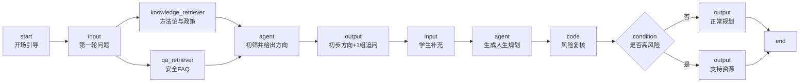

# E-Agent「AI 人生规划」智能体搭建手册

> 适用版本：E-Agent 2.3.0  
> 关联系统：浙江师范大学学业领航系统  
> 数据库：MySQL `academic_nav`  
> 现有入口：学生端 `/student/agents/life-planning`

## 0. 先看结论

“数据库作为知识库”建议拆成两层，不要把所有数据库表直接倒进向量知识库：

| 数据 | 接入方式 | 原因 |
|---|---|---|
| 培养方案、政策、规划方法论、FAQ | E-Agent 文档知识库 / QA 知识库 | 语义检索、静态知识 |
| 学生 GPA、五维画像、预警、发展路径 | SQL Agent 或 HTTP API 工具 | 实时、结构化、需要按学生隔离 |

推荐主线：

1. E-Agent 负责对话编排、知识检索、大模型推理和提示词。
2. 动态学生数据通过 E-Agent 的 **SQL Agent** 或 **API 工具** 实时查询。
3. 流程采用“先给方向，再问补充，最后出方案”，避免连续多轮只问问题。

## 1. 当前环境事实

| 资源 | 地址 / 状态 |
|---|---|
| E-Agent | `http://localhost:3001`，v2.3.0 |
| 现有人生规划分享页 | `http://localhost:3001/workspace/share/IWhc8a17ZoCo8wzAIxqXEj5kC0_A_Ezf` |
| 学业后端 | `http://localhost:8080` |
| 前端 | `http://localhost:5173` |
| MySQL | `localhost:3306/academic_nav` |

两个重要现状：

1. 当前 `localhost:3001` 是通过 SSH 隧道访问的 E-Agent 服务。也就是说，E-Agent 后端大概率不在本机。SQL Agent 里的 `127.0.0.1:3306` 指向的是 E-Agent 后端所在机器，不一定是 Windows 本机的 MySQL。
2. 当前人生规划分享页显示“当前应用未上线”。需要在 E-Agent 中新建或重新上线工作流，再把新分享链接写回前端。

因此在当前网络形态下，优先考虑“API 工具”或“后端代理”；只有当 MySQL 也部署在 E-Agent 后端可达的内网时，才使用 SQL Agent 直连。

针对“本机 MySQL + 远端 E-Agent 通过 SSH 映射访问”，详细命令见：

- [network/01_本地数据库连接远程E-Agent.md](network/01_本地数据库连接远程E-Agent.md)
- [scripts/start-eagent-chain-tunnel.ps1](../../scripts/start-eagent-chain-tunnel.ps1)

E-Agent 已验证支持的节点：

- `start`、`input`、`output`、`end`
- `llm`：普通大模型节点
- `agent`：自主规划，支持知识库、数据库、API/MCP 工具
- `knowledge_retriever`：文档知识库检索
- `qa_retriever`：QA 知识库检索
- `rag`：知识检索 + 大模型回答一体节点
- `code`：Python 代码节点
- `condition`：条件分支
- `report`：Word 报告模板

`agent` 节点的数据库配置支持 MySQL、PostgreSQL、Oracle、Db2、GaussDB。

变量写法说明：本文中的 `{{#node类型/变量名#}}` 是占位示例。在 E-Agent 编辑器中，应通过变量选择器选择真实节点和变量，生成带实际节点 ID 的引用，不要手工照抄类型名。

## 2. 三种数据库接入方式

### 方式 A：E-Agent SQL Agent 直连

适合 E-Agent 与 MySQL 在同一内网、同服务器，或本地开发时网络可达。

在“助手”节点中打开“数据库配置”：

| 字段 | 建议值 |
|---|---|
| database_engine | `MySQL` |
| db_address | `IP:3306`，不要只写 `localhost`，要确认是 E-Agent 后端所在的机器能访问的地址 |
| db_name | `academic_nav` |
| db_username | `eagent_readonly` |
| db_password | 独立强密码 |

优点：最少开发量，能直接回答“我的 GPA、排名、预警”等问题。  
限制：E-Agent 如果部署在远端，`localhost:3306` 很可能不是本机 MySQL，需额外打通网络。

### 方式 B：HTTP API 工具调用现有后端

适合 E-Agent 在远端、学校后端可以安全暴露，或以后切换校方数据源。

在 E-Agent 的“构建 -> 工具 -> API 工具”中导入 OpenAPI，创建以下工具：

| 工具 | 现有接口 | 用途 |
|---|---|---|
| `get_student_dashboard` | `GET /api/student/dashboard` | GPA、排名、学分、预警、体测 |
| `get_student_profile` | `GET /api/student/profile` | 五维画像、GPA/排名趋势 |
| `get_gpa_trend` | `GET /api/student/gpa-trend` | 学期 GPA |
| `get_student_alerts` | `GET /api/student/alerts` | 当前预警 |
| `get_development_paths` | `GET /api/development/paths` | 考研/留学/考公/考编/就业匹配 |
| `analyze_development_goal` | `POST /api/development/analyze` | 目标差距拆解 |

鉴权使用 `Authorization: Bearer <token>`。生产环境不能把学生 JWT 写死在 E-Agent 工具里，需要通过后端代理、短期上下文令牌或 E-Agent 用户与学校账号映射解决。

### 方式 C：现有前端经后端代理 E-Agent

这是生产推荐方案，安全性最高：

```text
学生前端
  -> /api/agents/{id}/chat
  -> Spring Boot：校验学生身份，读取本人数据
  -> 注入学生上下文
  -> 调用 E-Agent /api/v2/assistant/chat/completions
```

后端已经规划了 `/api/agents/*`、SSE、E-Agent 适配器，M4 可以按 `后端设置规划.md` 实施。E-Agent 不用直接接触数据库，也不需要把学生 token 暴露给第三方页面。

## 3. 第一步：准备只读数据库账号和视图

执行本目录中的 SQL：

```powershell
mysql -uroot -p academic_nav < docs/e-agent-人生规划智能体/sql/01_eagent_readonly.sql
```

原则：

- 只授权 `SELECT`，不给 `INSERT/UPDATE/DELETE/DROP`。
- 只授权业务视图，不让智能体直接查询密码、联系方式、心理原始备注等敏感字段。
- 视图固定“当前学生本人的数据范围”，避免模型生成任意 SQL 越权。

## 4. 第二步：建知识库

这里说的“知识库”不是 MySQL 数据库，而是 E-Agent 里的文档知识库和 QA 知识库。内容已经生成好，不需要重新创建；文件在本项目的：

```text
docs/e-agent-人生规划智能体/knowledge/
outputs/eagent-formal-data/knowledge_package/
```

在 E-Agent 的“文件库”中创建 3 个知识库：

| 知识库 | 类型 | 上传文件 | 用途 |
|---|---|---|---|
| `人生规划方法论` | 文档知识库 | `knowledge/01_人生规划方法论.md`、`knowledge/02_大学生发展路径与阶段任务.md` | 规划框架、四年阶段任务 |
| `人生决策与路径库` | 文档知识库 | `knowledge/03_考研留学就业考公决策框架.md`、`knowledge/04_浙师大学业与就业政策FAQ.md` | 路径选择、政策边界 |
| `人生规划安全FAQ` | QA 知识库 | 上传 `outputs/eagent-formal-data/人生规划安全FAQ.xlsx`，列名为 `question`、`answer` | 风险识别、心理支持转介 |

建议检索设置：

- 关键词与向量权重：`0.5 / 0.5`
- 开启结果重排
- 单次检索结果长度：`15000` 字符以内
- 元数据：`domain`、`grade`、`risk_level`、`audience`

元数据示例：

| 文件 | domain | grade | risk_level | audience |
|---|---|---|---|---|
| 01_人生规划方法论 | method | all | low | student |
| 02_大学生发展路径与阶段任务 | path | all | low | student |
| 03_考研留学就业考公决策框架 | decision | junior,senior | low | student |
| 04_浙师大学业与就业政策FAQ | policy | all | medium | student |
| 05_心理与学业风险识别 | safety | all | high | student |

## 5. 第三步：创建 E-Agent 工作流

### 5.1 节点流程图



### 5.2 节点配置

#### 节点 1：`start`

| 参数 | 配置 |
|---|---|
| 开场白 | 使用 `prompts/01_开场与引导.md` |
| 引导问题 | “我现在适合考研还是工作？”、“帮我规划大学剩余阶段”、“如何把兴趣和就业结合起来？”、“我该怎么找到适合自己的方向？” |
| 全局变量 | `current_time`、`chat_history=20`、`student_context`、`student_no`、`student_context_token` |

#### 节点 2：`input`（第一轮）

| 参数 | 配置 |
|---|---|
| 类型 | 对话框输入 |
| 输入变量 | `user_input` |
| 文件上传 | 可关闭，首版不需要 |

#### 节点 3：`knowledge_retriever`

| 参数 | 配置 |
|---|---|
| 用户问题 | `{{#input/user_input#}}` |
| 检索范围 | `人生规划方法论`、`人生决策与路径库` |
| 元数据过滤 | 首版只按 `audience=student` 过滤 |
| 检索结果变量 | `retrieval_planning` |

#### 节点 4：`qa_retriever`

| 参数 | 配置 |
|---|---|
| 输入变量 | `{{#input/user_input#}}` |
| QA 知识库 | `人生规划安全FAQ` |
| 相似度阈值 | `0.80` |
| 检索结果变量 | `retrieval_faq` |

#### 节点 5：`agent`（初筛与信息补全）

| 分组 | 配置 |
|---|---|
| 模型 | 配置好的推理模型，首版建议温度 `0.2-0.4` |
| 系统提示词 | `prompts/02_初筛与信息补全.md` |
| 用户提示词 | `prompts/02_初筛与信息补全.md` 中的用户提示词模板 |
| 知识库范围 | `人生规划方法论`、`人生决策与路径库` |
| 数据库配置 | 方式 A 时开启，指向 `eagent_readonly` |
| 工具 | 方式 B 时添加 6 个学业 API 工具 |
| 历史聊天记录 | 20 条 |
| 输出展示 | 开启 |
| 输出变量 | `first_direction` |

#### 节点 6：`output`（第一轮结果）

“消息内容”直接引用 `{{#agent/first_direction#}}`，交互类型选择“无交互”或“输入型交互”，让第二轮 `input` 接住用户回答。

#### 节点 7：`input`（第二轮补充）

| 参数 | 配置 |
|---|---|
| 输入变量 | `supplement_input` |

#### 节点 8：`agent`（正式规划）

| 分组 | 配置 |
|---|---|
| 系统提示词 | `prompts/03_主规划师.md` |
| 用户提示词 | 汇总 `user_input`、`supplement_input`、`first_direction`、`retrieval_planning`、`retrieval_faq`、`student_context` |
| 数据库 / 工具 | 同节点 5 |
| 输出展示 | 关闭，交给最终 `output` 节点 |
| 输出变量 | `final_plan` |

#### 节点 9：`code`（风险复核，可先跳过）

入参：

```text
final_plan = {{#agent/final_plan#}}
```

执行代码：

```python
def main(final_plan: str) -> dict:
    text = (final_plan or "").strip()
    crisis_words = ["自残", "自杀", "轻生", "伤害自己", "不想活", "长期失眠", "重度抑郁"]
    risk_level = "high" if any(word in text for word in crisis_words) else "normal"
    return {
        "risk_level": risk_level,
        "requires_human": risk_level == "high"
    }
```

出参：`risk_level`、`requires_human`。

#### 节点 10：`condition`（可选）

| 分支 | 条件 |
|---|---|
| 正常 | `{{#code/risk_level#}} equals normal` |
| 高风险 | `{{#code/risk_level#}} equals high` |

#### 节点 11：`output`

- 正常分支消息：`{{#agent/final_plan#}}`
- 高风险分支消息：使用 `prompts/05_最终输出与风险提示模板.md`，只给资源和支持信息，不做临床诊断。

#### 节点 12：`end`

## 6. 数据库查询提示词

复制到 `prompts/06_数据查询提示词.md`，并在 `agent` 节点数据库工具打开时追加到系统提示词。

标准查询需求举例：

| 用户问题 | SQL Agent 自然语言查询 |
|---|---|
| 我的基本情况 | “查询学号 `{{student_no}}` 的当前学生档案” |
| GPA 趋势 | “查询学号 `{{student_no}}` 最近 5 个学期的 GPA、排名和专业平均 GPA” |
| 五维画像 | “查询学号 `{{student_no}}` 最近学期的五维画像分数” |
| 预警情况 | “查询学号 `{{student_no}}` 状态为 pending 或 processing 的最近 10 条预警” |
| 挂科情况 | “查询学号 `{{student_no}}` 近两年的 failed/retake 课程及成绩” |
| 考研院校 | “查询 type=grad、tier=top/good/match 的院校，按 match_score 从高到低取 9 条” |
| 留学院校 | “查询 type=overseas 的院校，按 match_score 从高到低取 9 条” |
| 就业岗位 | “查询适合该专业的岗位，按 match_score 从高到低取 15 条” |

## 7. 发布并接入现有前端

1. E-Agent 工作流保存后点击“上线”。
2. 复制分享链接。
3. 打开：

```text
academic-navigation-demo/src/mock/agents.ts
```

找到 `life-planning`，替换：

```ts
iframeUrl: 'http://localhost:3001/workspace/share/新的分享ID'
```

也可以改成 E-Agent API 直连：

```ts
externalApi: {
  type: 'eagent',
  baseUrl: 'http://localhost:3001',
  assistantId: 'E-Agent中的assistant或model ID'
}
```

## 8. 验收测试

至少验证以下 10 类场景：

1. 大一学生问“大学四年怎么规划”，首轮必须给出 2-3 个方向。
2. 提问不超过 3 个，且不重复询问数据库中已有信息。
3. GPA 3.8 的学生选择考研，能引用五维画像给出三梯度院校建议。
4. GPA 2.2 且有多条预警的学生，先给学业恢复建议，再谈长期目标。
5. 教育类专业学生问就业，能推荐教师编、教育技术、跨专业就业等路径。
6. 计算机学生问就业，能调用 `t_job_cache` 的 match_score 推荐岗位。
7. 用户说“我也不确定”，智能体先缩小选项，而不是继续无限提问。
8. 无法查询到数据库数据时，明确说明“暂未读取到”，不编数字。
9. 高风险词汇出现时，只给校内支持资源，不诊断、不承诺。
10. 回复中区分事实、计算依据和个性化建议。

## 9. 安全与隐私清单

- [ ] E-Agent 数据库账号只有 `SELECT`。
- [ ] 不暴露 `t_user.password`、联系方式、心理原始备注。
- [ ] 学生身份由系统确定，不能仅凭用户自己输入的学号。
- [ ] API 密钥不放在前端 `agents.ts`。
- [ ] 心理、健康、预警等高敏感问题增加风险转介提示。
- [ ] 会话、查询日志、模型输出按学校数据安全制度留存和审计。
- [ ] 校方真实数据接入后，重新做数据最小化和权限验证。

## 10. 配套文件

| 文件 | 用途 |
|---|---|
| `sql/01_eagent_readonly.sql` | 只读账号和视图 |
| `knowledge/01_人生规划方法论.md` | 知识库文档 |
| `knowledge/02_大学生发展路径与阶段任务.md` | 知识库文档 |
| `knowledge/03_考研留学就业考公决策框架.md` | 知识库文档 |
| `knowledge/04_浙师大学业与就业政策FAQ.md` | 知识库文档 |
| `knowledge/05_心理与学业风险识别.md` | 风险识别材料 |
| `prompts/01_开场与引导.md` | start 节点提示词 |
| `prompts/02_初筛与信息补全.md` | 第一轮 agent 提示词 |
| `prompts/03_主规划师.md` | 第二轮 agent 提示词 |
| `prompts/04_知识检索提示词.md` | 知识检索节点提示词 |
| `prompts/05_最终输出与风险提示模板.md` | 输出模板 |
| `prompts/06_数据查询提示词.md` | SQL/API 工具使用规则 |
| `config/academic-openapi.yaml` | E-Agent API 工具 OpenAPI 模板 |
| `network/01_本地数据库连接远程E-Agent.md` | 本地库、SSH 反向隧道、VPN、内网穿透方案 |
| `scripts/start-eagent-tunnel.ps1` | 一键启动 E-Agent 访问隧道模板 |
| `scripts/start-eagent-chain-tunnel.ps1` | 适配当前 node1 -> E-Agent 主机两段拓扑的启动/停止/状态脚本 |
| `scripts/export-eagent-formal-data.ps1` | 从本机 MySQL 导出正式数据包与脱敏清单 |
| `数据正式接入SOP.md` | 正式数据导入、校验、E-Agent 配置和学校 API 接入流程 |
| `连接验证与排障.md` | 判断 E-Agent 是否已连到本地数据库的诊断步骤 |
| `E-Agent前端报错排障.md` | QA XLSX 导入报错和绕行方案 |
| `学生身份与数据.md` | 学生身份、成绩数据、重复回答与多轮对话说明 |
| `E-Agent API访问说明.md` | E-Agent API v2 开启与调用方式 |
