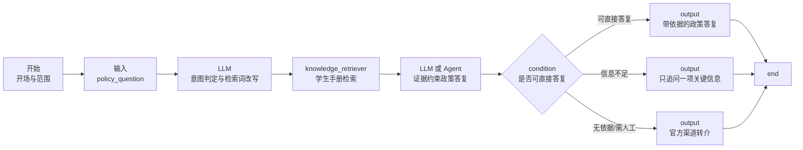

# 浙江工商大学 AI 校策知询 - E-Agent 搭建手册

## 1. 交付范围与知识边界

本智能体面向浙江工商大学**全日制普通本科生**，依据《浙江工商大学学生手册（2025 汇编）》回答校内教学管理、学生管理、评奖评优、资助助学等政策问题。

本手册共 316 页，收录 48 项制度；其正文包含不同年份、不同发文机关的制度，不能把“2025 汇编”理解为每一条规则均于 2025 年发布或仍未修订。因此，智能体必须把该手册称为“当前已接入的 2025 汇编版资料”，并在以下情形明确提示用户向对应部门确认最新通知：申请窗口、名单、公示、金额、收费标准、材料清单、审批结果、制度是否修订。

不回答或只提供转介的信息：研究生政策、招生录取、校外机构的实时政策、个案审批结论、医疗或法律结论。附录中的国家规定仅作为背景，学校具体执行以校内制度为主。

## 2. 知识库准备

在 E-Agent 的“文件库”新建一个**文档知识库**，命名为 `浙工商本科学生手册（2025汇编）`，上传原始 PDF：

`C:\Users\BenBen\Downloads\浙江工商大学学生手册.pdf`

推荐解析与检索配置：

| 配置项 | 建议值 |
| --- | --- |
| 解析方式 | 按标题/段落优先；保留页码、章节名、条号 |
| 分段长度 | 500-800 中文字符 |
| 分段重叠 | 80-120 中文字符 |
| 召回数量 | 6 条；重排后交给模型 3-5 条 |
| 检索方式 | 关键词与向量混合，各 0.5；开启重排 |
| 召回阈值 | 0.55 起调；低于阈值视为“证据不足” |
| 文档元数据 | `school=浙江工商大学`、`audience=全日制普通本科生`、`edition=2025汇编`、`source_type=学生手册` |

如果 E-Agent 支持单个文档级元数据，可增加下列 `domain` 标签；否则通过文档标题/分段标题完成分类。

| domain | 对应手册内容 |
| --- | --- |
| `academic` | 学籍、课程、成绩、补考重修、转专业、休复学、毕业学位、辅修、实习、创新学分 |
| `campus` | 考场、图书馆、公寓、网络、收费、违纪处分、申诉、社团、户口、电动自行车、医保 |
| `award` | 素质评价、先进个人、优秀毕业生、校级/省政府/国家奖学金 |
| `aid` | 资助、勤工助学、国家励志奖学金、国家助学贷款 |

首版只接入这一份 PDF，不要把未经核验的网络文章、学生群聊天记录或旧版 FAQ 混入同一知识库。后续新增政策时，单独上传带发布部门、发布日期、有效状态的官方原文，并将旧版本标记为 `status=archived`。

## 3. 工作流总览

建立工作流，名称：`浙工商 AI 校策知询（本科生）`。采用单轮优先、必要时追问一项信息的闭环，避免让学生重复描述。



不要在此智能体接入学生成绩、身份证号、家庭经济情况或心理信息。它是静态政策问答，不需要 SQL Agent 或学生画像 API；这样可明显降低越权和隐私风险。

## 4. 节点逐项配置

### 节点 1：开始（`start`）

| 字段 | 值 |
| --- | --- |
| 名称 | 开场与边界 |
| 开场白 | 使用 `prompts/01_开场与边界.md` 中“开场白” |
| 引导问题 | `转专业有哪些限制？`、`补考不及格怎么办？`、`国家奖学金如何申请？`、`休学后怎样复学？`、`违纪处分可以申诉吗？` |
| 全局变量 | `current_time`、`chat_history=12` |

### 节点 2：输入（`input`）

| 字段 | 值 |
| --- | --- |
| 名称 | 接收政策问题 |
| 输入变量 | `policy_question` |
| 文件上传 | 关闭 |
| 提示语 | `请直接描述你想了解的校内政策，例如“我大二能转专业吗？”` |

### 节点 3：LLM（`llm`）

| 字段 | 值 |
| --- | --- |
| 名称 | 意图判定与检索词改写 |
| 模型温度 | 0-0.1 |
| 系统提示词 | `prompts/02_意图判定与检索词改写.md` |
| 用户提示词 | `用户问题：{{#input/policy_question#}}` |
| 输出变量 | `query_plan` |

该节点只输出严格 JSON，供后续节点使用。若版本的知识检索节点不能引用 JSON 字段，可把 `query_plan.search_query` 映射为一个文本输出变量；变量引用必须用 E-Agent 编辑器的变量选择器生成，勿手写节点 ID。

### 节点 4：知识检索（`knowledge_retriever`）

| 字段 | 值 |
| --- | --- |
| 名称 | 学生手册证据检索 |
| 知识库 | `浙工商本科学生手册（2025汇编）` |
| 查询文本 | `{{#llm/query_plan#}}` 中的 `search_query`；不支持字段映射时直接传整个 `query_plan` |
| 召回数 | 6 |
| 重排后结果 | 3-5 |
| 输出变量 | `handbook_evidence` |

### 节点 5：LLM 或助手（`llm` / `agent`）

首版推荐普通 `llm`，因为这里只需要引用静态资料，输出更稳定；仅在后续接入多个知识库、API 或人工工单时改用 `agent`。

| 字段 | 值 |
| --- | --- |
| 名称 | 证据约束政策答复 |
| 温度 | 0.1-0.2 |
| 系统提示词 | `prompts/03_证据约束政策答复.md` |
| 用户提示词 | 见下方模板 |
| 输出变量 | `answer_json` |

用户提示词模板：

```text
用户问题：{{#input/policy_question#}}

意图与检索计划：{{#llm/query_plan#}}

仅可使用的手册检索证据：{{#knowledge_retriever/handbook_evidence#}}

请按系统提示词输出 JSON，不要输出 JSON 之外的内容。
```

### 节点 6：条件分支（`condition`）

从 `answer_json.route` 分三路。若界面不能直接解析 JSON，增加一个简短 `code` 节点读取 `answer_json`，输出 `route` 与 `display_answer`，代码见 `prompts/04_路由与人工转介.md`。

| 分支 | 条件 | 后续节点 |
| --- | --- | --- |
| `answer` | `route == answer` | 输出政策答复 |
| `clarify` | `route == clarify` | 输出单项追问 |
| `refer` | `route == refer` | 输出转介说明 |

### 节点 7A：输出（`output`）

| 字段 | 值 |
| --- | --- |
| 名称 | 政策答复 |
| 消息内容 | `{{#llm/answer_json#}}` 中的 `display_answer` |
| 输出交互 | 无交互 |

### 节点 7B：输出（`output`）

| 字段 | 值 |
| --- | --- |
| 名称 | 关键信息追问 |
| 消息内容 | `{{#llm/answer_json#}}` 中的 `display_answer` |
| 输出交互 | 输入型交互；把用户补充带入下一次工作流即可 |

### 节点 7C：输出（`output`）

| 字段 | 值 |
| --- | --- |
| 名称 | 官方渠道转介 |
| 消息内容 | `{{#llm/answer_json#}}` 中的 `display_answer` |
| 输出交互 | 无交互 |

三条输出均连接到 `end`。这使每次请求独立完成，前端将会话历史传回即可支持连续追问。

## 5. 上线前验收

按 `tests/验收问题集.md` 逐题在 E-Agent 调试窗口运行。每题必须检查：答案是否只引用检索证据、是否写出条款或制度名称、是否把申请资格与最终审批区分、是否对无依据内容说“不确定”、是否没有凭空给出联系人、金额或截止日期。

通过后点击“上线”，再将工作流 ID 替换到前端 `academic-navigation-demo/src/mock/agents.ts` 的 `policy-advisor`（AI 校策知询）配置中 `externalApi.workflowId`。不要修改同一配置中现有的地址或密钥，除非同时完成服务端密钥轮换；生产环境请让后端代理 E-Agent，不能把 `EAGENT_API_KEY` 写入浏览器。

## 6. 维护规则

1. 每学期初复核教务处、学生处、学生资助中心的最新通知；有新文件时补充原文并标记生效日期。
2. 政策原文存在冲突时，以发布日期更晚、发布层级更高且仍有效的官方文件为准；未确认前走 `refer`。
3. 对“我是否一定能获批”“我现在具体能拿多少钱”这类个案，永远不得作承诺，只说明条件、流程和确认渠道。
4. 记录匿名问题类别、命中文档、`route` 与人工转介原因，用于调优，不记录不必要的个人敏感数据。
